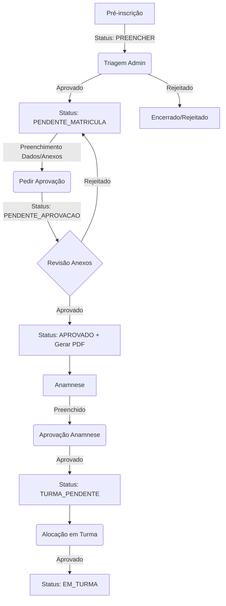

# 📦 Documentação do Sistema – ONG de Aceitação de Crianças

---

# 📄 1. PRD (Product Requirements Document)

## 🎯 Objetivo
Construir um sistema web para gerenciar o processo de inscrição, matrícula, anamnese e alocação de crianças em turmas de uma ONG, garantindo conformidade com a LGPD e um fluxo rigoroso de aprovações.

---

## 👥 Usuários
- Administradores (Dashboard, Triagem, Aprovações, Gestão de Turmas)
- Responsáveis (Formulário público de Pré-inscrição)

---

## 🧩 Funcionalidades

### 1. Pré-inscrição
- Formulário público para coleta inicial de dados.
- Envio de dados para o sistema com status inicial `PREENCHER`.
- Notificações automáticas (Email/WhatsApp opcional).

### 2. Triagem
- Visualização dos dados da pré-inscrição pelo Admin.
- Aprovação inicial: Se aprovado, avança para `PENDENTE_MATRICULA`.

### 3. Matrícula (Censo Socioeconômico)
- **Dados Pessoais:** Coleta de documentos (CPF, RG, Certidão) de crianças e responsáveis.
- **Módulo de Moradia:** Detalhamento da situação habitacional e infraestrutura doméstica.
- **Composição Familiar:** Cadastro de todas as pessoas que residem na casa, incluindo idade, ocupação e renda individual.
- **Gestão de Contatos:** Múltiplos telefones de referência e recado.
- **Upload de Arquivos:** Sistema de anexos para comprovação dos dados declarados.
- **Botão "Pedir aprovação de matrícula":** Altera status para `PENDENTE_APROVACAO`.
- **Regra Crítica:** A matrícula só pode ser aprovada se os arquivos anexados não forem nulos e os módulos obrigatórios estiverem preenchidos.

### 4. Anamnese
- Inicia apenas após a aprovação da matrícula (`APROVADO`).
- Coleta de dados sensíveis de saúde e histórico.
- Requer aprovação do Admin após o preenchimento.

### 5. Turmas
- Alocação da criança baseada em idade e turno.
- Tela de "Aprovar criança na turma" antes da alocação final.
- Status final: `EM_TURMA`.

### 6. Detalhes Turmas 
- ABA EXIBINDO TODAS AS TURMAS.
- POSSO VER TODAS AS CRIANÇAS DA TURMA X.

---

## 📊 Regras de Negócio
- Fluxo estritamente controlado por status.
- Bloqueio de etapas subsequentes sem aprovação da etapa anterior.
- Obrigatoriedade de anexos para aprovação de matrícula.
- Registro de auditoria em todas as mudanças de status e acesso a dados sensíveis.

---

# 🔐 2. LGPD – Diretrizes

## 📌 Dados Sensíveis
Este sistema lida com dados de menores e informações de saúde (Anamnese), exigindo proteção máxima.

## ✅ Requisitos LGPD
- Consentimento explícito e logado.
- Criptografia de campos sensíveis no banco de dados.
- Logs de auditoria (quem acessou/alterou o quê e quando).
- Acesso restrito por perfil de usuário.

---

# 🏗️ 3. Arquitetura

## 📦 Stack
- Laravel 11
- MySQL
- DomPDF (Geração de comprovantes)

---

# 🔄 4. Fluxo de Estados (Mermaid)

---

# 🧠 5. Estados do Sistema

- `PREENCHER`: Aguardando triagem inicial.
- `PENDENTE_MATRICULA`: Aprovado na triagem, aguardando dados detalhados.
- `PENDENTE_APROVACAO`: Dados de matrícula enviados, aguardando revisão de anexos.
- `APROVADO`: Matrícula concluída e aprovada (Geração de PDF disponível).
- `ANAMNESE`: Em fase de preenchimento/avaliação de saúde.
- `ANAMNESE_CONCLUIDA`: Saúde avaliada e aprovada.
- `TURMA_PENDENTE`: Aguardando alocação em turma.
- `EM_TURMA`: Alocação final concluída.
- `REJEITADO`: Inscrição descartada em qualquer etapa.

---

# 📌 6. Próximos Passos de Desenvolvimento

1.  Ajustar as Views do Dashboard para o novo fluxo de status.
2.  Implementar a lógica de upload e verificação de anexos na matrícula.
3.  Desenvolver o módulo de Anamnese com aprovação.
4.  Criar o sistema de alocação em turmas com validação de idade/turno.
